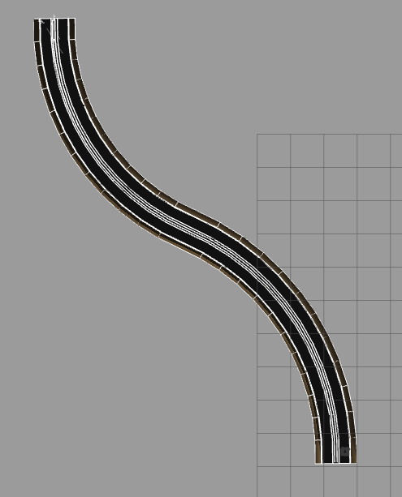
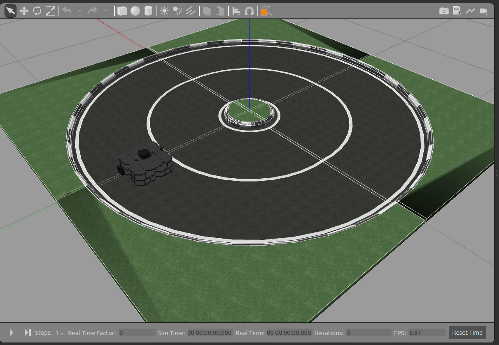
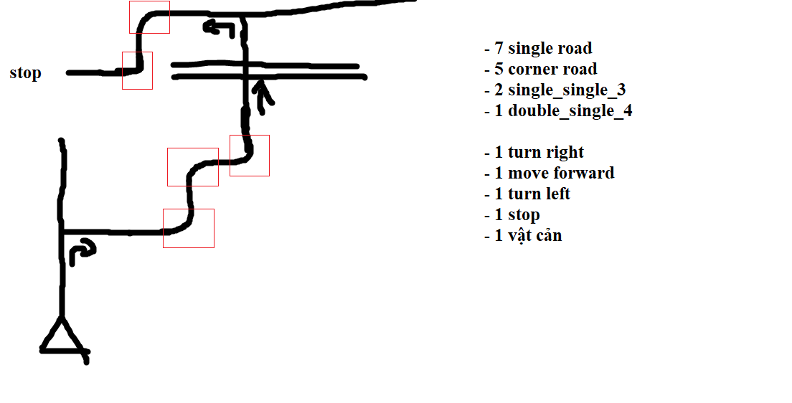
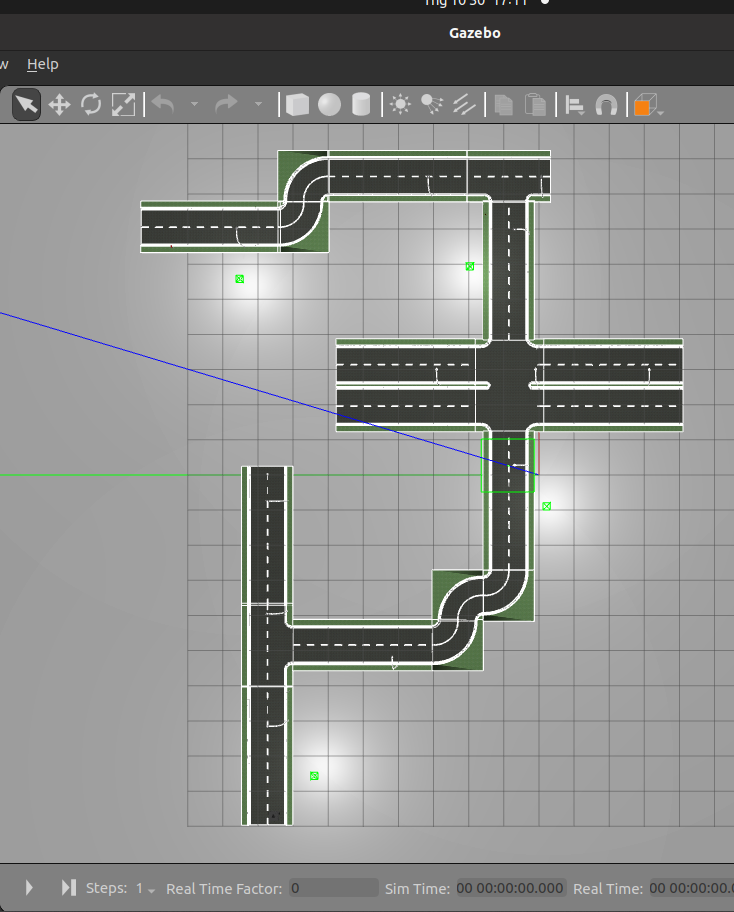

# How to use this git

1. Go to catkin_ws/src/turtlebot3_simulations/turtlebot3_gazebo in your computer
2. Copy exactly the same folder from github to the folder in your computer.


# How to simulate a world with Gazebo
1. ```export TURTLEBOT3_MODEL=waffle_pi``` (only waffle_pi has a camera)
2. ```roslaunch turtlebot3_gazebo <name of world>.launch```
    - There is a list of worlds below that you can choose

# List of world:
1. hill_world.launch:


2. circle_world.launch 


3. map_2.launch:



4. map_tkll.launch: