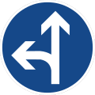
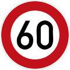
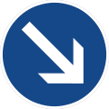

ROAD:
----

- single road (đường 1 chiều):

- double road (đường 2 chiều):

- change_lane (dùng để quay đầu xe):

- corner road (đường cong):

- single_single_3 (ngã 3 1-1, một chiều giao với 1 chiều):

- double_single_3 (ngã 3 2-1):

- double_double_4 (ngã 4 2-2):

- double_single_4 (ngã 4 2-1):

- bonus hill_road (hình dấu ~):

TRAFFIC-SIGN:
------------

- 0-ahead-only:

- 1-ahead-turn-left:

- 2-ahead-turn-right:

- 3-do-not-enter:

- 4-ice-snow:

- 5-maximum-speed-limit60:

- 6-pass-by-left:

- 7-pass-by-right:

- 8-pedestrian-crossing:

- 9-road-closed-prohibit:

- 10-road-work:

- 11-stop:

- 12-turn-left-ahead:

- 13-turn-right-ahead:

- 14-watch-for-children:

